# Task_04
# RTL Design of Finite State Machines (FSM) and Control Units

## Objective

This project demonstrates the RTL implementation and simulation of Finite State Machines (FSMs) using Verilog HDL. The task includes the design and verification of Moore FSM, Mealy FSM, Traffic Light Controller, and Sequence Detector circuits along with their respective testbenches and waveform analysis.

---

## Tools Used

* Verilog HDL
* EDA Playground
* Icarus Verilog
* GTKWave

---

## Repository Structure

```text
Task_04_FSM_Design/
│
├── README.md
│
├── Task Files/
│   ├── moore_fsm.v
│   ├── moore_fsm_tb.v
│   ├── mealy_fsm.v
│   ├── mealy_fsm_tb.v
│   ├── sequence_detector_1011.v
│   ├── sequence_detector_tb.v
│   ├── traffic_light.v
│   └── traffic_light_tb.v
│
├── Screenshots/
│   ├── moore_fsm.jpg
│   ├── moore_fsm_tb.jpg
│   ├── moore_fsm_output.jpg
│   ├── mealy_fsm.jpg
│   ├── mealy_fsm_tb.jpg
│   ├── mealy_fsm_output.jpg
│   ├── sequence_detector.jpg
│   ├── sequence_detector_tb.jpg
│   ├── seq_det_output.jpg
│   ├── traffic_light.jpg
│   ├── traffic_light_tb.jpg
│   └── traffic_light_output.jpg
│
└── Report/
    └── Task_04_Report.pdf
```

---

# 1. Moore FSM

## Description

A Moore FSM is a finite state machine in which the output depends only on the current state. The FSM transitions through predefined states based on clock signals.

### Verilog Design

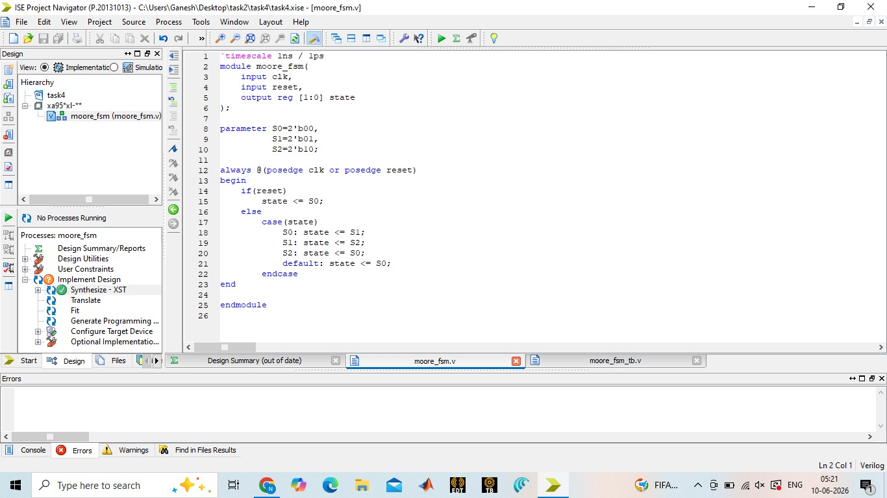

### Testbench

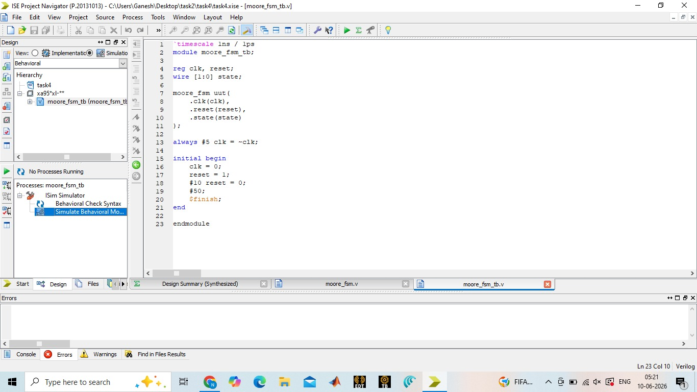

### Output Waveform

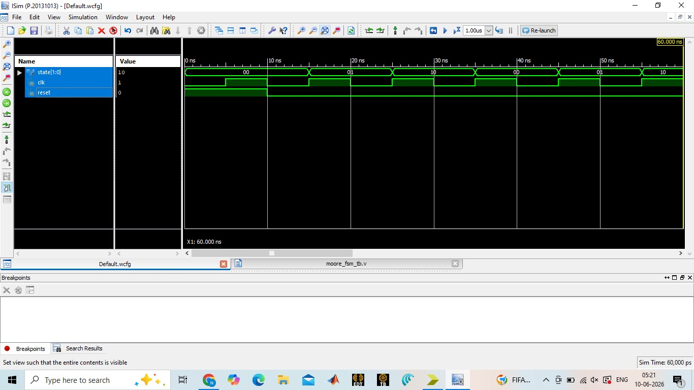

### Observation

The FSM transitions correctly through all states on each positive clock edge and returns to the initial state upon reset.

---

# 2. Mealy FSM

## Description

A Mealy FSM generates outputs based on both the current state and the input signal. This allows outputs to change immediately when the input changes.

### Verilog Design

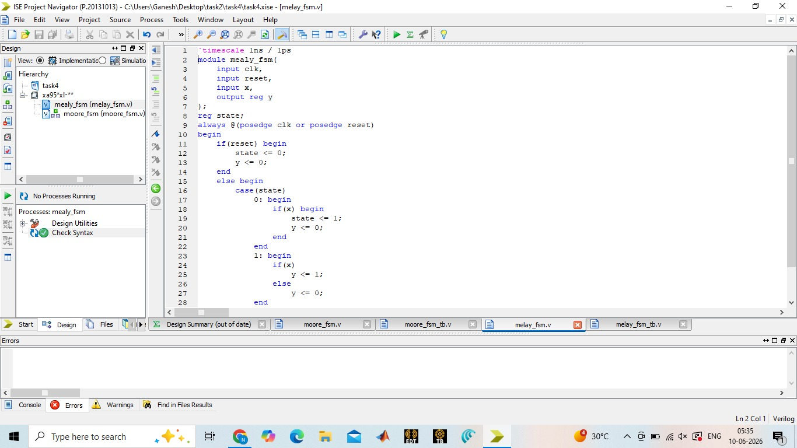

### Testbench

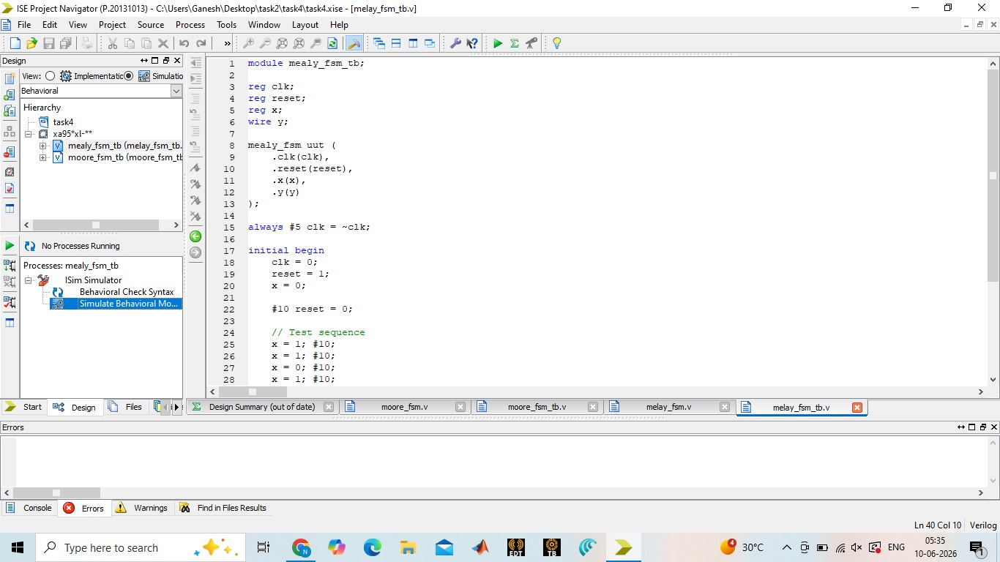

### Output Waveform

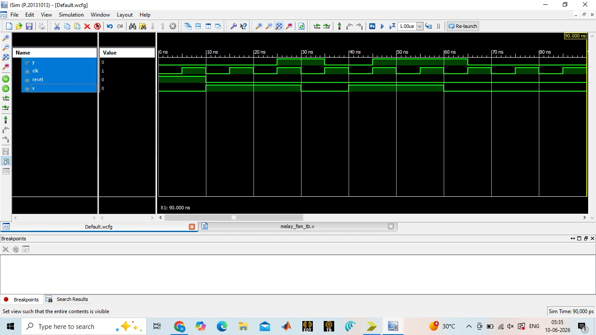

### Observation

The output responds to both state transitions and input conditions, demonstrating correct Mealy machine functionality.

---

# 3. Traffic Light Controller

## Description

The Traffic Light Controller is a practical FSM application used to control traffic signals. The controller cycles through Green, Yellow, and Red states in a fixed sequence.

### Verilog Design

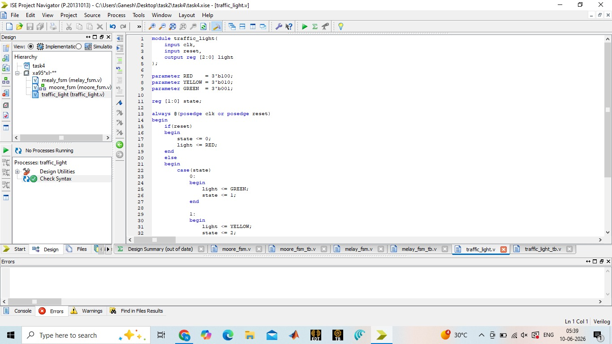

### Testbench

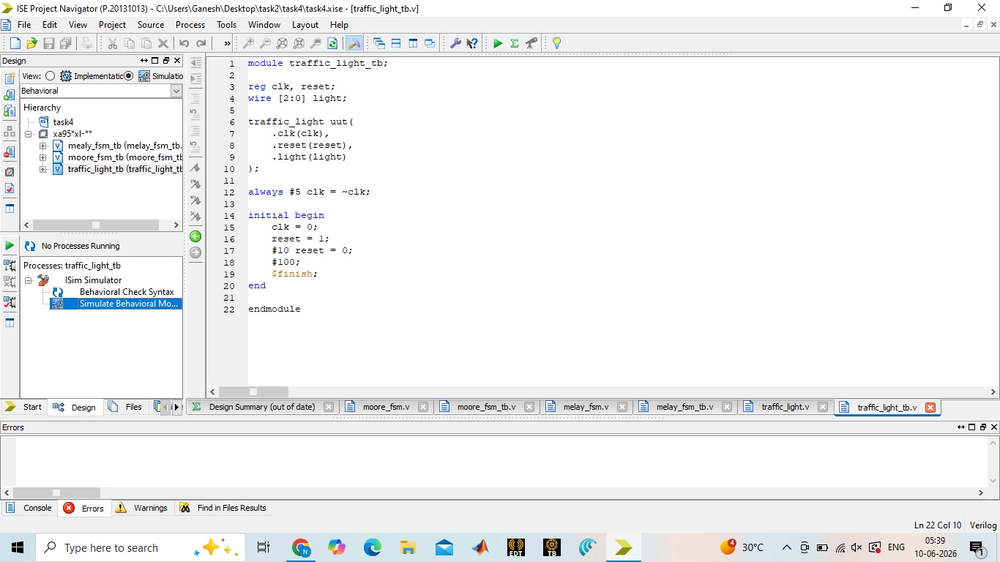

### Output Waveform

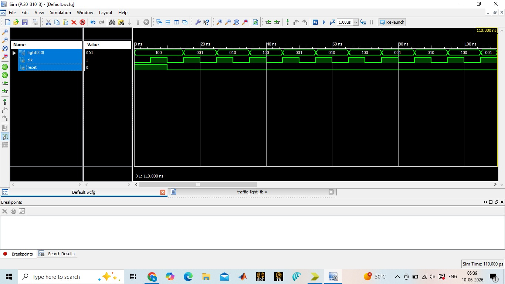

### Observation

The controller correctly transitions through all traffic light states, ensuring proper sequencing and timing.

---

# 4. Sequence Detector (1011)

## Description

The Sequence Detector identifies the binary pattern "1011" in a serial input stream and generates a detection signal when the pattern is recognized.

### Verilog Design

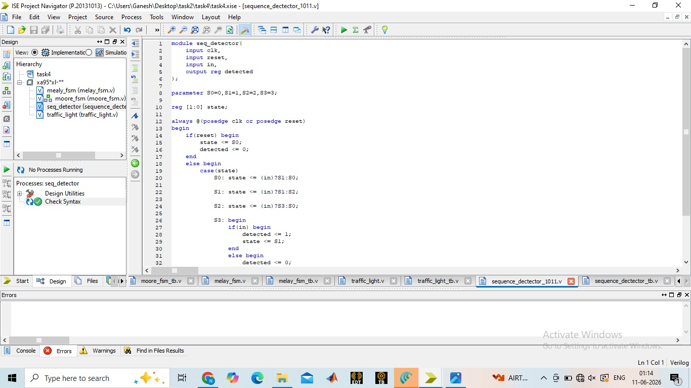

### Testbench

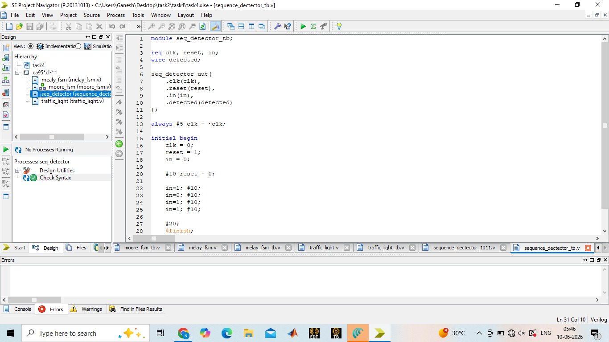

### Output Waveform

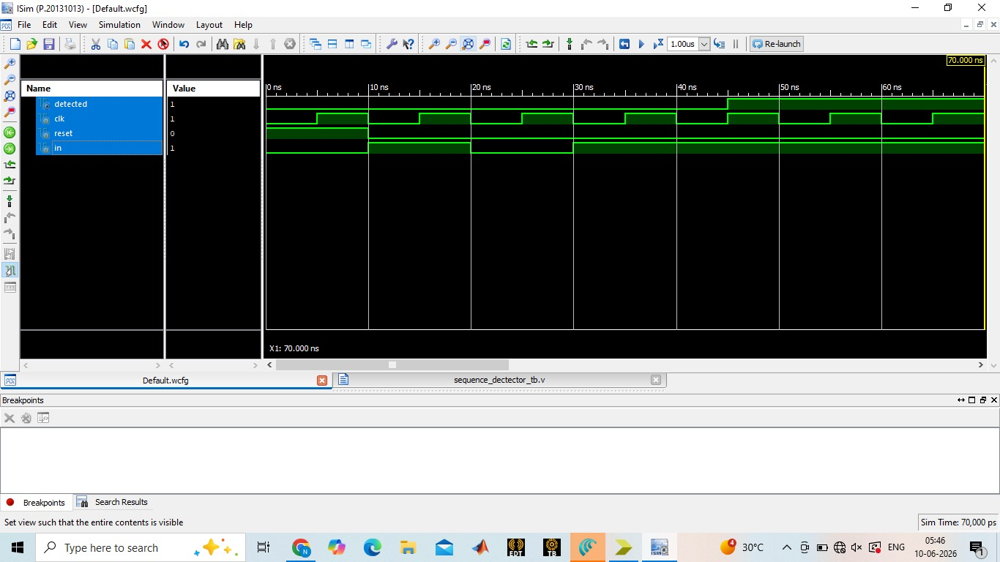

### Observation

The detector successfully identifies the target sequence and produces the output signal at the correct clock cycle.

---

# Results

The following FSM-based designs were successfully implemented and verified:

* Moore FSM
* Mealy FSM
* Traffic Light Controller
* Sequence Detector (1011)

All modules were tested using dedicated testbenches and validated through simulation waveforms.

---

# Key Concepts Learned

* Finite State Machines (FSM)
* Moore Machine Design
* Mealy Machine Design
* State Transition Logic
* Sequence Detection
* Traffic Light Controller Design
* Verilog HDL Coding
* Testbench Development
* RTL Design Methodology
* Waveform Analysis and Verification

---

# Conclusion

This project provided hands-on experience in designing and simulating FSM-based digital circuits using Verilog HDL. Through the implementation of Moore FSM, Mealy FSM, Traffic Light Controller, and Sequence Detector designs, a strong understanding of sequential circuit behavior, state transitions, and verification methodologies was achieved. The successful simulation results validated the correctness of all designs and strengthened practical RTL design skills essential for VLSI and FPGA development.

---
#Author
P Sai Kumar
VLSI Intern
